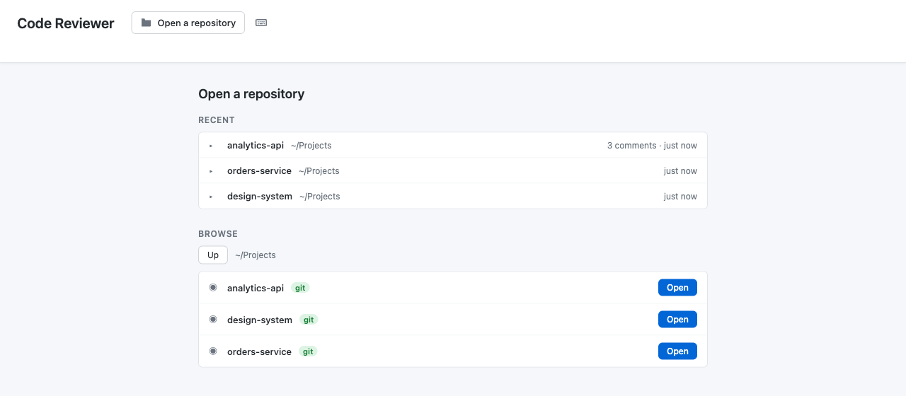

# reviewer

[](https://github.com/dheerajjha/reviewer/actions/workflows/ci.yml)
[](LICENSE)
[](package.json)
[](test/)
[](package.json)

When an agent writes the code, reading it becomes the bottleneck — and the tool
built for reading a diff, the pull request, wants a branch, a remote and a push
you are not ready to make yet.

`reviewer` gives you the pull-request view of your working directory instead:
inline comments with threaded follow-ups, each attached to the exact line you
mean, with no branch, no remote, no push and no account. Then it hands the
marked-up review back to the agent to act on.

```bash
npm install -g git-reviewer

cd ~/your-project
reviewer | claude -p "Apply this review."
```

That is the whole loop. `reviewer` opens the review in your browser; when you
press **Submit Review**, the review is written to stdout and the command
exits — so whatever is on the other end of the pipe receives it and starts
work. Nothing to copy, no second command, no file to go and find.

Without a pipe, `reviewer` is just a review tool: it tells you where the
review was saved and keeps serving, because you may have more to read.
Everything it says to you goes to stderr either way, so only the review is
ever on stdout.


*One command, start to finish, unedited — [full resolution](docs/demo.mp4). Every
frame is the real tool: the terminal output is captured from the run you are
watching, and the code at the end is what the agent actually wrote.*

Nothing is installed into the project, there is nothing to sign in to, and
nothing leaves your machine. If you would rather not install it,
`npx git-reviewer` works the same way.

When the review and the hand-off happen at different times, the two-step form
still works and is the one to reach for:

```bash
reviewer                                            # read the diff, comment on it
reviewer export . --format prompt | claude -p "Apply this review."
```

Comments persist between sessions and survive the code moving underneath them —
including the agent's own edits, which shift every line below the first change —
so a review you wrote yesterday still points at the right lines today. When you
would rather read the review than pipe it, it also writes a plain Markdown file
you can paste anywhere.


Click a line number, write the note, keep going. Replies thread under the
comment they answer, and everything is saved as you type.

## Usage

```
reviewer [repository] [options]
reviewer export [repository] [--format json|prompt]

  repository        A git repository, or any directory inside one
                    (default: the current directory)

  -p, --port <n>    Port to listen on (default 4500; falls back to a free
                    port if that one is taken)
      --no-open     Print the URL instead of opening a browser
  -f, --format <f>  Export format: json (default) or prompt
  -h, --help        Show help
  -v, --version     Show the version
```

```bash
reviewer                    # review the repository you are standing in
reviewer ~/work/api         # review another one
reviewer . --no-open        # print the URL, open it yourself
reviewer . --port 8080      # somewhere other than 4500
```

Two at once is fine — the second one finds its own port.

### When you are not standing in a repository

The page opens on a picker rather than on an empty box:

- **Recent** — repositories you have opened before, newest first, with how many
  comments are saved against each. One click reopens one.
- **Browse** — walk the filesystem from your home directory. Repositories are
  marked, so you can see where to stop; a folder row walks into it, and the
  button beside a marked one opens it.

Only directory names are listed, never file names, and the two endpoints behind
this refuse a request a browser says came from another origin.

The header leads with the repository you have open; click it to switch. Beside
it is a small keyboard icon that reveals a path box, for when the path is
already on your clipboard and a navigator is the slow way round.



To install it as a command rather than running it through `npx`:

```bash
npm install -g git-reviewer
reviewer .
```

The package is `git-reviewer` because `reviewer` and `code-reviewer` were both
already taken on npm. It installs the command under both names, so whichever
one you reach for is the one that is there:

```bash
reviewer                    # the command
git-reviewer                # the package name, if that is what you typed
git reviewer                # git dispatches to it like any other subcommand
```

From a clone, if you would rather not install anything:

```bash
git clone https://github.com/dheerajjha/reviewer.git
cd reviewer && npm install && npm link
```

## What it shows you

`reviewer` picks what to review based on the state of the repository, so there
is nothing to configure:

| Repository state | What you review |
|---|---|
| Uncommitted changes present | Your working directory against `HEAD` |
| Working directory clean | The last commit against its parent |
| No commits yet | Every tracked and untracked file, as wholly new |

### Comparing branches and commits

Those defaults cover the common case with nothing to set up, but a branch you
have worked on for a day is several commits deep, and the default scope only
ever shows the most recent one.

**Compare branches** in the header opens the comparison your pull request would
show. If the repository has an obvious base — `origin/main`, then `main`, then
`master` or `develop` — it compares your current branch against it straight
away; otherwise it asks. Remote branches come first because a local `main` that
has not been pulled in a week is a quietly wrong base.

Both ends are pickers: **Base** and **Compare**, the same two words a pull
request uses. Each lists branches, remote branches, tags and recent commits, so
you do not have to go and find a SHA. **Other…** at the bottom of either takes
anything else git understands — `HEAD~5`, a tag, a SHA from somewhere else. The
⇄ button swaps them, which answers the other question: what has `main` got that
my branch has not?

**It shows what the branch changes, not everything that differs.** If `main`
has moved on since your branch was cut, a plain two-ended diff would include
`main`'s newer work *reversed*, as though your branch had undone it. The
comparison starts from where the two diverged instead, exactly as a pull
request does, and says what it left out:

```
main → feature/auth    3 commits · 2 files changed

main has 1 newer commit that is not on feature/auth. It is left out: this shows
only what feature/auth changes since the two diverged, as a pull request would.
```

An empty comparison explains itself rather than showing a blank list. Two
commits that add a file and then delete it produce no diff between the ends —
correctly — and that reads as *"2 commits undo each other"*, not as *"nothing
to review"*.

#### Reviewing commit by commit

Whenever the review is made of commits, the sidebar lists them above the files:
the commits a comparison is made of, oldest first, or the branch's recent
history when you are looking at its last commit.

- **Click** a commit to review it on its own, with its full message above the
  diff — often the only place the author says *why*.
- **Shift-click** a second to review the run between them, both ends included.
  From the last commit, shift-clicking three rows down is "the last three
  commits"; inside a comparison, it skips the ones you have already read.
- **`[`** and **`]`** step one commit older or newer, and **All commits** goes
  back to the whole comparison.

That is the same gesture a pull request's commit picker uses, for the same
reasons: a large change reads better in the order it was written, and one
commit of renames is easier to skip than to read around.

A run has to be one unbroken line of history. To diff two points that are not
— a commit on one branch against another branch — use **Compare**; its pickers
list recent commits of whichever branch you are comparing, right after the
local branches.

Comments are kept when you switch between comparisons. One on a file that is
not in the current view stays in the comments list, marked **Not in this
view**, and is back in place whenever you open a view that includes the file.

Modified, added, deleted, renamed, and binary files are all listed, each marked
with its git status letter. Deleted lines are commentable too — the most useful
review note is often about the code someone removed. A file deleted outright is
shown in full, read back out of `HEAD`:


## Reviewing

| Action | How |
|---|---|
| Comment on a line | Click the line number |
| Comment on a snippet | Hold `Cmd/Ctrl`, select code, then click the line number |
| Reply to a comment | Click **Reply** on it |
| Edit or delete | Hover the comment |
| Finish the review | Click **Submit Review** |

| Shortcut | Action |
|---|---|
| `Cmd/Ctrl+Enter` | Save the comment being written |
| `Escape` | Cancel input |
| `↑` / `↓` | Move between files |

None of that is guessable — a column of line numbers does not look clickable —
so the app shows you rather than telling you. **Reviewing, in four moves** opens
by itself the first time you review anything, and lives behind the `?` in the
header after that. Each move is a small animation of the gesture itself.

## What it writes

Two files, both plain text you can read without this app, both in a per-user
data directory outside the install:

| platform | location |
| --- | --- |
| macOS | `~/Library/Application Support/git-reviewer` |
| Linux, BSD | `$XDG_DATA_HOME/git-reviewer`, else `~/.local/share/git-reviewer` |
| Windows | `%LOCALAPPDATA%\git-reviewer` |

Set `REVIEWER_DATA_DIR` to put them anywhere else. They are deliberately *not*
kept inside the installed package: that directory belongs to npm, which deletes
it on upgrade and on uninstall, and `npx` puts it in a cache that is pruned
without warning. A review you wrote by hand is the most expensive thing this
tool holds.

- **`.code-review-comments-<repo>.json`** — the live state of the review. It is
  written on every edit and is the source of truth; reopening the same
  repository restores exactly what is in it.
- **`review_<repo>_<timestamp>.txt`** — a submitted review, rendered from that
  JSON as Markdown, grouped by file and ordered by line:

````markdown
# Code Review

Repository: /work/my-app
Generated: 2026-08-10T12:30:45.678Z
Total Comments: 2

## src/auth.js

**Line 42:**
```
  const token = req.headers.authorization;
```
This trusts the header without checking the scheme.

**Follow-ups:**
  1. Still open after the rebase (2026-08-10T14:02:11.000Z)
````

Timestamps are ISO 8601 rather than a locale format on purpose: a review gets
committed, pasted into a pull request, and read on someone else's machine, so
its shape should not depend on the reader.

Submitting shows you exactly what was written, ready to download or copy:


## Handing the review to a coding agent

A review is only half the work; applying it is the other half. `reviewer
export` prints the review you saved — no server, no submit step — either as
JSON or as instructions ready to pipe:

```bash
reviewer export . --format prompt | claude -p "Apply this review to the repo."
reviewer export . | jq '.comments[].file'
```

Every comment carries an `anchor`: the exact text of the line it was left on.
Line numbers go stale the moment an agent makes its first edit, because
everything below shifts — so the anchor is what lets a comment still be found.
The prompt format says so to the agent explicitly, and tells it to report
rather than guess when an anchor has vanished.

```json
{
  "schema": "code-review/v1",
  "repository": { "path": "/work/api-service", "head": "abe3b37", "branch": "main" },
  "summary": { "comments": 2, "files": 1 },
  "comments": [
    {
      "id": "src/auth.js:10",
      "file": "src/auth.js",
      "line": 10,
      "anchor": "  if (scheme !== SCHEME || !token) return null;",
      "body": "Reject an empty token too.",
      "followUps": [{ "body": "Still open after the rebase", "at": "2026-08-10T14:00:00.000Z" }]
    }
  ]
}
```

Submitting in the UI writes this alongside the `.txt`. The full schema is in
[docs/agent-format.md](docs/agent-format.md).

## HTTP API

The UI is a client of this; nothing is hidden from you.

| Endpoint | Purpose |
|---|---|
| `GET /api/health` | Liveness, plus the number of open sessions |
| `POST /api/load-repo` | Open a repository; returns a `repoId` and the changed files. Pass `base` (and optionally `head`) to compare two refs from their merge base, or `commits: { from, to }` to review one commit or an unbroken run of them, both ends included |
| `GET /api/refs/:repoId` | Branches, remote branches, tags and recent commits, for choosing what to compare. `?head=` makes the commits those of another branch |
| `GET /api/log/:repoId` | Commits with their messages: `?base=&head=` for a comparison's commits, oldest first, or `?head=` alone for recent history, newest first |
| `GET /api/commits/:repoId` | Recent commits only; kept for callers of 2.11 |
| `GET /api/alive` | Held open by the page; when the last one closes, a terminal run stops |
| `GET /api/file/:repoId/:path` | The file's diff, as structured lines |
| `GET /api/file-full/:repoId/:path` | Every line of the file, for context |
| `POST /api/save-comments` | Persist the current comments |
| `GET /api/load-comments/:repoId` | Restore saved comments |
| `POST /api/submit-review` | Render the saved comments to a review file |
| `DELETE /api/cleanup/:repoId` | End the session; files on disk are untouched |

A `repoId` is a random per-session handle, not a path. Requests that resolve
outside the opened repository are refused, and a path that names nothing gets a
404.

`npm run serve` starts the server on its own, without opening a browser.

## Security

The server binds to `127.0.0.1`. It reads any file in the repository you
opened, so reaching it should require being on the machine running it — set
`HOST=0.0.0.0` only if you mean it. Every path that reaches the filesystem is
resolved through a check that it lands inside that repository, so a request for
`..%2f..%2fetc%2fpasswd` is refused rather than served.

If you find a way past that, please report it through
[security advisories](https://github.com/dheerajjha/reviewer/security/advisories/new)
rather than a public issue.

## Development

```bash
npm install           # 3 dependencies, no build step, ~6MB
npm test              # 355 tests
npm run test:watch
npm run test:coverage
```

```
bin/reviewer.js  the command: parse args, start server, open browser
server.js        Express app factory and routes
lib/
  cli.js           argument parsing and URL building
  browser.js       opening a URL on each platform
  diff.js          unified diff -> structured lines
  paths.js         confines request paths to the repository
  changes.js       git status and commit summaries -> changed files
  comments.js      the persisted comment shape
  review.js        rendering and naming review files
  sessions.js      repoId -> repository
public/          UI: index.html, style.css, app.js
test/            Node test runner; HTTP tests drive real git repositories
```

The request handlers hold no logic worth testing — it lives in `lib/`, and
`server.js` exports `createApp()` so a test can point an instance at a
temporary directory. The HTTP tests do not stub git: each one builds a real
repository in a temp directory and runs real `git` against it, because diff
parsing is exactly where a stub would be wrong in the same way the code is.

Tests run on Linux and macOS across Node 18, 20, and 22. See
[CONTRIBUTING.md](CONTRIBUTING.md).

## Tech

Express, [simple-git](https://github.com/steveukx/git-js), and vanilla
JavaScript in the browser. Three runtime dependencies, no dev dependencies, no
build step for the frontend, no test framework — the tests use the one built
into Node.

Version 2.0 dropped the Electron wrapper. It added a few hundred megabytes and
a per-platform build pipeline to put a browser engine around a page your
browser already renders. See [CHANGELOG.md](CHANGELOG.md).

## Contributing

There is a list of [open issues](https://github.com/dheerajjha/reviewer/issues),
including some tagged
[good first issue](https://github.com/dheerajjha/reviewer/issues?q=is%3Aissue+is%3Aopen+label%3A%22good+first+issue%22).
The ones most likely to change how the tool feels:

- [#2](https://github.com/dheerajjha/reviewer/issues/2) — give comments a state, so a review can be worked through and marked off
- [#3](https://github.com/dheerajjha/reviewer/issues/3) — report whether each anchor still matches the file
- [#4](https://github.com/dheerajjha/reviewer/issues/4) — expose the review over MCP, so an agent works through it interactively
- [#6](https://github.com/dheerajjha/reviewer/issues/6) — review a commit range, not just the working tree

[CONTRIBUTING.md](CONTRIBUTING.md) covers the setup and what a good change looks
like here.

## License

[MIT](LICENSE) © Dheeraj Jha
